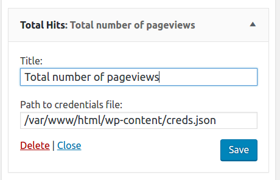

# WPTotalHits

Total Hits for Wordpress is a widget plugin which shows the total number of hits on your website and a basic chart with hits for the last 7 days. The data is taken from your Google Analytics account via Google Analytics API. The widget is inspired by the similar widget that is available on [blogger.com](https://blogger.com).

## Features

- displays total number of hits and a chart for the last 7 days
- uses official Google API client for PHP
- caches the results of the API calls for 2 hours using [Transient API](https://codex.wordpress.org/Transients_API)
- renders the chart using [Google Charts SDK](https://developers.google.com/chart/)
- allows styling via CSS classes
- minimum configuration

## Prerequisites

Before you can use the widget you need to create a service user for it in your Google Account. The service user has restricted permissions and can only read data in your Google Analytics account. [The steps to create such a user](https://developers.google.com/analytics/devguides/reporting/core/v4/quickstart/service-php) are the following:

- Open the [Service accounts](https://console.developers.google.com/permissions/serviceaccounts) page. If prompted, select a project.
- Click **Create service** account.
- In the **Create service** account window, type a name for the service account, and select **Furnish a new private key**. Then click Create.

Download and save the credentials file in the JSON format.

## Installation

- install the plugin.
- upload the credentials file to your server in such place that is not available for everyone.
- go to Appearance - Widgets and drag-n-drop the TotalHits widget. Configure the Title and Path to the credentials file on your service.
- save the widget

## Screenshots

Backend

Frontend

